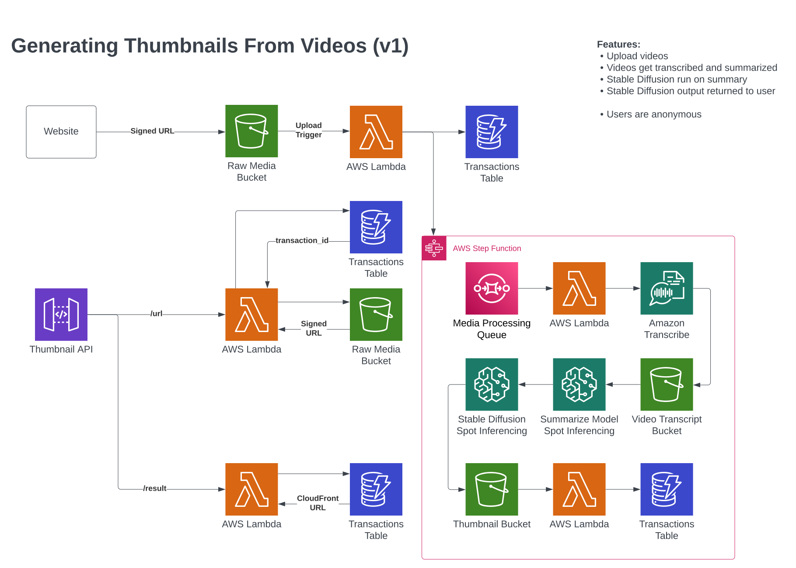

# Thumbnail

Try to generate thumbnails for uploaded videos using Stable Diffusion, Transcribe, and Summarize.

## Process

1. User uploads a video to the service
2. AWS Transcribe generates a video transcript
3. Summarize model outputs a 1-2 video summary
4. Stable Diffusion uses this summary to generate a thumbnail image

## Architecture Diagram

